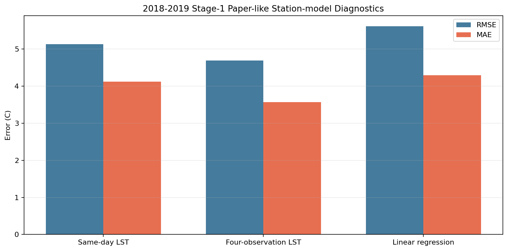
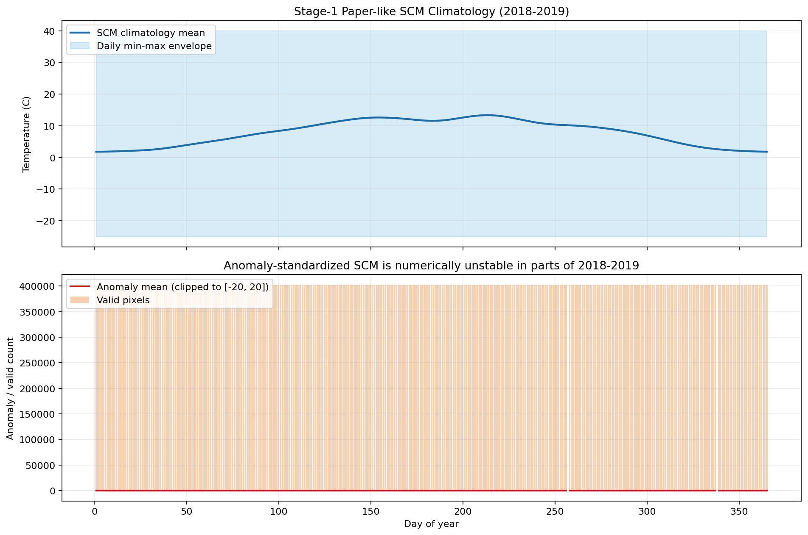
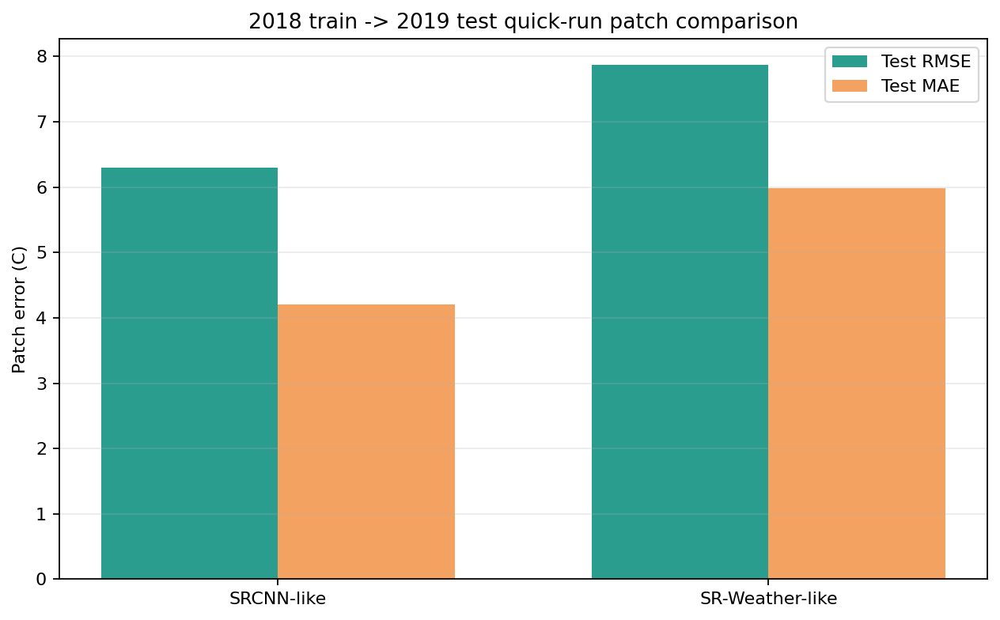

# Stage-1 Long-timeseries Results: 2018-2019

## Scope

这份报告承接 [stage1_2018_fullyear_results.md](/E:/18664-C5F119/华为家庭存储/CUBD/Research/HXGG2025-6-2/hxgg2025-6-2/25to1/stage1_2018_fullyear_results.md)，把 Stage-1 从 `2018` 全年扩到了 `2018-01-01 ~ 2019-12-31`，并完成了：

- `2019` 原始数据补齐与预处理
- `2018-2019` merged collocation / paper-like label dataset
- `2018-2019` daily paper-like label grids
- `2018-2019` paper-like `SCM climatology`
- 基于长时序 `SCM` 的跨年 patch quick-run
- 结果分析和图表沉淀

## Completion Snapshot

- `2019 MOD11A1` 已补齐：`1095` granules，对应 [mod11a1_2019_manifest.json](/E:/18664-C5F119/华为家庭存储/CUBD/Research/HXGG2025-6-2/hxgg2025-6-2/25to1/data/stage1/interim/mod11a1_2019_manifest.json)
- `2019 MOD13A2 NDVI` 已补齐：`72` granules，对应 [mod13a2_2019_manifest.json](/E:/18664-C5F119/华为家庭存储/CUBD/Research/HXGG2025-6-2/hxgg2025-6-2/25to1/data/stage1/interim/mod13a2_2019_manifest.json)
- `2019 ERA5 t2m / ssrd` 已补齐：`12 + 12` 月文件
- `2019 ASOS/AWS` 日表已规范化：`440` 个站文件，对应 [stations_chunk420_2019](/E:/18664-C5F119/华为家庭存储/CUBD/Research/HXGG2025-6-2/hxgg2025-6-2/25to1/data/stage1/processed/stations_chunk420_2019)
- merged collocation 已到 `319562` 行，对应 [stage1_station_collocations_2018_01_summary.json](/E:/18664-C5F119/华为家庭存储/CUBD/Research/HXGG2025-6-2/hxgg2025-6-2/25to1/data/stage1/processed/station_collocations_asos64_aws_chunk420_2018_2019full/stage1_station_collocations_2018_01_summary.json)
- paper-like dataset 已到 `317236` 行，对应 [stage1_modis_at_paperlike_dataset_summary.json](/E:/18664-C5F119/华为家庭存储/CUBD/Research/HXGG2025-6-2/hxgg2025-6-2/25to1/data/stage1/processed/modis_at_paperlike_dataset_asos64_aws_chunk420_2018_2019full/stage1_modis_at_paperlike_dataset_summary.json)
- daily paper-like grids 已补到 `2018-12-31`，目录在 [modis_at_paperlike_grids_linear_clip_2018_2019full](/E:/18664-C5F119/华为家庭存储/CUBD/Research/HXGG2025-6-2/hxgg2025-6-2/25to1/data/stage1/processed/modis_at_paperlike_grids_linear_clip_2018_2019full)
- paper-like `SCM` 已生成，目录在 [scm_paperlike_linear_clip_2018_2019full](/E:/18664-C5F119/华为家庭存储/CUBD/Research/HXGG2025-6-2/hxgg2025-6-2/25to1/data/stage1/processed/scm_paperlike_linear_clip_2018_2019full)

## Data And Label Summary

`2018-2019` 版主数据集是：

- collocation 主表: [stage1_station_collocations_2018_01.csv](/E:/18664-C5F119/华为家庭存储/CUBD/Research/HXGG2025-6-2/hxgg2025-6-2/25to1/data/stage1/processed/station_collocations_asos64_aws_chunk420_2018_2019full/stage1_station_collocations_2018_01.csv)
- paper-like 标签数据集: [stage1_modis_at_paperlike_dataset.csv](/E:/18664-C5F119/华为家庭存储/CUBD/Research/HXGG2025-6-2/hxgg2025-6-2/25to1/data/stage1/processed/modis_at_paperlike_dataset_asos64_aws_chunk420_2018_2019full/stage1_modis_at_paperlike_dataset.csv)

其中：

- 总行数：`317236`
- `AWS train`: `270702` 行，`379` 站
- `ASOS validate`: `46534` 行，`64` 站
- 带全四次 LST 的行数：`26167`
- 带任意 LST 的行数：`229057`

需要特别注意的是：虽然 split 后的总行数很多，但**完整特征覆盖并没有那么大**。重新诊断后，`11` 个论文式特征全部齐全且目标有效的 complete-case 只有：

- 总计：`26144`
- `AWS train`: `21944`
- `ASOS validate`: `4200`

这个诊断文件在 [training_diagnostics_rerun.json](/E:/18664-C5F119/华为家庭存储/CUBD/Research/HXGG2025-6-2/hxgg2025-6-2/25to1/data/stage1/models/modis_at_paperlike_asos64_aws_chunk420_2018_2019full/training_diagnostics_rerun.json)。

## Station-model Diagnostics

我把 `2018-2019` 的 station-level paper-like 标签模型重新诊断了一遍，优先采用 [training_diagnostics_rerun.json](/E:/18664-C5F119/华为家庭存储/CUBD/Research/HXGG2025-6-2/hxgg2025-6-2/25to1/data/stage1/models/modis_at_paperlike_asos64_aws_chunk420_2018_2019full/training_diagnostics_rerun.json)，因为旧的 [training_summary.json](/E:/18664-C5F119/华为家庭存储/CUBD/Research/HXGG2025-6-2/hxgg2025-6-2/25to1/data/stage1/models/modis_at_paperlike_asos64_aws_chunk420_2018_2019full/training_summary.json) 里 `train_rows=3135` 明显和数据集现状不一致，更像是中间态结果。

`AWS train -> ASOS validate` 下，当前更可信的诊断是：

- `same_day_lst_mean`: `RMSE 5.132`
- `four_obs_lst_mean`: `RMSE 4.691`
- `linear_regression_full_train_validate`: `RMSE 5.612`

`pooled time split (2019-10-01)` 下：

- `linear_regression`: `RMSE 4.238`

结论有两点：

1. 在 `2018-2019` 这版 long-timeseries 数据上，**四次 LST 均值仍然是很强的 baseline**。
2. 现在这版 paper-like 线性模型还没有稳定超越 `four_obs_lst_mean`，说明长时序扩展虽然补足了 `SCM` 基线，但**标签模型本身还没有达到论文里的质量水平**。

## SCM Analysis

`2018-2019` 的 paper-like `SCM` 清单在 [manifest.json](/E:/18664-C5F119/华为家庭存储/CUBD/Research/HXGG2025-6-2/hxgg2025-6-2/25to1/data/stage1/processed/scm_paperlike_linear_clip_2018_2019full/manifest.json)。

这次的关键改进是：

- daily label items: `728`
- `365` 个 day-of-year 都有 raw observation
- `11-day` 环状平滑 + `10` 次 temporal fill 已完成
- `ERA5` calendar-day mean/std 也开始具备多年份条件：`std_valid_doy = 363`

但是结果很重要也很诚实：

- `SCM climatology_365` 是可用的
- `SCM anomaly_standardized_365` 现在**数值上仍然很不稳**

图表摘要在 [assets_summary.json](E:/18664-C5F119/华为家庭存储/CUBD/Research/HXGG2025-6-2/hxgg2025-6-2/25to1/reports/stage1_longtimeseries_2018_2019/assets_summary.json)：

- climatology mean 年循环范围：`1.807C ~ 13.342C`
- anomaly 输出里，`365` 个 DOY 中有 `286` 天出现了极端异常值

这意味着：**两年虽然已经足够把 climatology 立起来，但还不够让 anomaly-standardized SCM 完全健康。** 当前最稳妥的工程选择，是把 `climatology_365` 当作可用版 `SCM`，而不是直接把 anomaly 图送进模型。

## Patch-model Quick Run

为了把长时序 `SCM` 真正接进模型，我做了一个跨年 quick-run：

- patch index: [stage1_patch_index_summary.json](/E:/18664-C5F119/华为家庭存储/CUBD/Research/HXGG2025-6-2/hxgg2025-6-2/25to1/data/stage1/processed/stage1_patch_index_2018_2019full_daily5_ps64_s64_v50/stage1_patch_index_summary.json)
- 采样策略：每天保留约 `5` 个 patch
- 总 patch：`3640`
- `2018 train`: `1815`
- `2019 test`: `1825`

基于 `scm_paperlike_c` 的结果：

- `srcnn_like`: [training_summary.json](/E:/18664-C5F119/华为家庭存储/CUBD/Research/HXGG2025-6-2/hxgg2025-6-2/25to1/data/stage1/models/stage1_patch_cnn_scmpaperlike_2018train_2019test_daily5_ps64_s64_v50/training_summary.json)
  - `test MAE 4.204`
  - `test RMSE 6.297`
- `sr_weather_like`: [training_summary.json](/E:/18664-C5F119/华为家庭存储/CUBD/Research/HXGG2025-6-2/hxgg2025-6-2/25to1/data/stage1/models/stage1_patch_sr_weather_like_scmpaperlike_2018train_2019test_daily5_ps64_s64_v50/training_summary.json)
  - `test MAE 5.983`
  - `test RMSE 7.873`

这一轮 quick-run 的结论是：

1. 在当前 `2018 train -> 2019 test` 的跨年设定下，**`srcnn_like` 仍明显稳于 `sr_weather_like`**。
2. 这组数值整体偏高，不该直接拿去和前面短时段 bootstrap patch 结果比较。
3. 当前 patch 模型的主要瓶颈已经不是“有没有接 `SCM`”，而是**上游 paper-like label model 本身的误差还比较大**，所以 patch 目标图像本身噪声很重。

## Key Deliverables

- `2018` 全年报告: [stage1_2018_fullyear_results.md](/E:/18664-C5F119/华为家庭存储/CUBD/Research/HXGG2025-6-2/hxgg2025-6-2/25to1/stage1_2018_fullyear_results.md)
- `2018-2019` 长时序 collocation: [stage1_station_collocations_2018_01.csv](/E:/18664-C5F119/华为家庭存储/CUBD/Research/HXGG2025-6-2/hxgg2025-6-2/25to1/data/stage1/processed/station_collocations_asos64_aws_chunk420_2018_2019full/stage1_station_collocations_2018_01.csv)
- `2018-2019` paper-like dataset: [stage1_modis_at_paperlike_dataset.csv](/E:/18664-C5F119/华为家庭存储/CUBD/Research/HXGG2025-6-2/hxgg2025-6-2/25to1/data/stage1/processed/modis_at_paperlike_dataset_asos64_aws_chunk420_2018_2019full/stage1_modis_at_paperlike_dataset.csv)
- 站点级重新诊断: [training_diagnostics_rerun.json](/E:/18664-C5F119/华为家庭存储/CUBD/Research/HXGG2025-6-2/hxgg2025-6-2/25to1/data/stage1/models/modis_at_paperlike_asos64_aws_chunk420_2018_2019full/training_diagnostics_rerun.json)
- daily paper-like grids: [manifest.json](/E:/18664-C5F119/华为家庭存储/CUBD/Research/HXGG2025-6-2/hxgg2025-6-2/25to1/data/stage1/processed/modis_at_paperlike_grids_linear_clip_2018_2019full/manifest.json)
- paper-like SCM: [manifest.json](/E:/18664-C5F119/华为家庭存储/CUBD/Research/HXGG2025-6-2/hxgg2025-6-2/25to1/data/stage1/processed/scm_paperlike_linear_clip_2018_2019full/manifest.json)
- 图表资产脚本: [build_stage1_longtimeseries_report_assets.py](/E:/18664-C5F119/华为家庭存储/CUBD/Research/HXGG2025-6-2/hxgg2025-6-2/25to1/scripts/build_stage1_longtimeseries_report_assets.py)

## Bottom Line

这次长时序扩展已经把两件最重要的事情跑实了：

- `2018-2019` 的 **paper-like SCM climatology 已经立起来了**
- 跨年的 Stage-1 patch 模型也已经能真正吃到这套 `SCM`

但同时也把当前最大的瓶颈暴露得更清楚了：

- `SCM climatology` 可以用
- `SCM anomaly_standardized` 还不稳
- patch 侧不是主矛盾
- **主矛盾仍然是上游 paper-like MODIS-AT 标签模型的质量**

所以接下来的最优先方向，不是继续堆 patch backbone，而是：

1. 继续把标签体系往更多年份扩
2. 让 calendar-day anomaly standardization 变得稳定
3. 再用更干净的长时序标签重训 Stage-1 patch 模型
