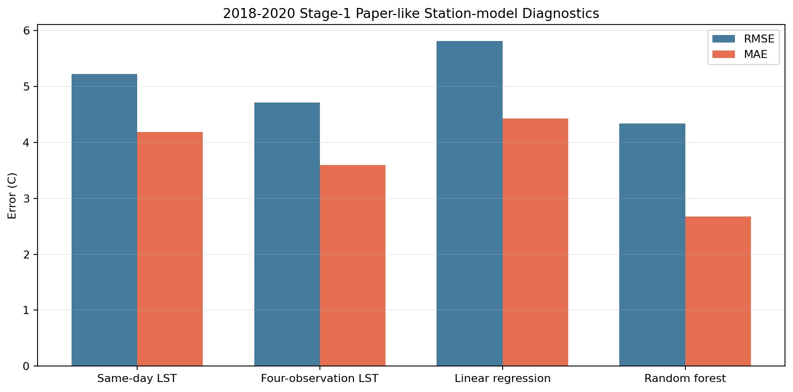
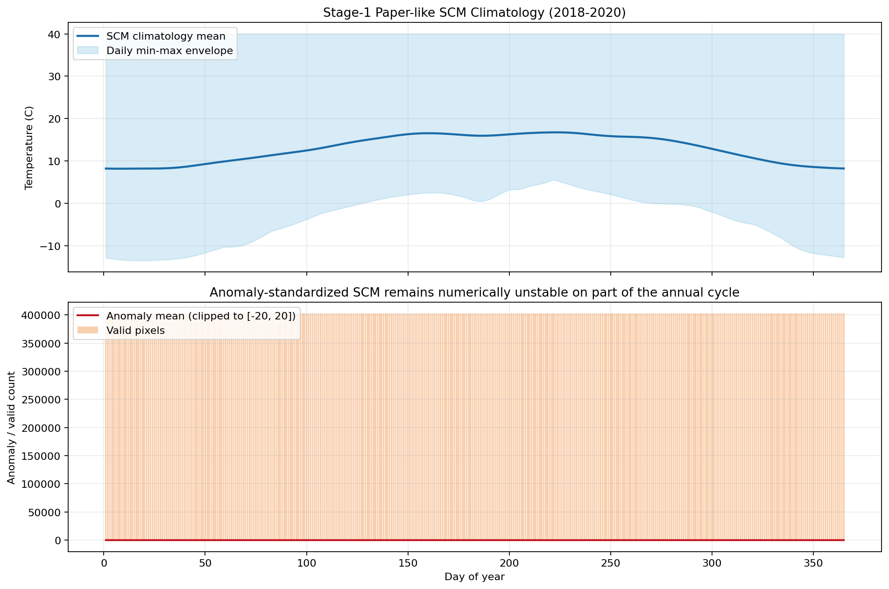
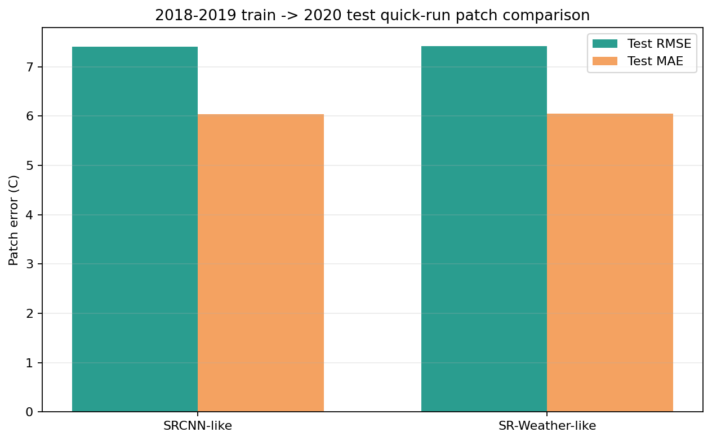

# Stage-1 Long-timeseries Results: 2018-2020

## Scope

这份报告承接 [stage1_2018_2019_longtimeseries_results.md](/E:/18664-C5F119/华为家庭存储/CUBD/Research/HXGG2025-6-2/hxgg2025-6-2/25to1/stage1_2018_2019_longtimeseries_results.md)，把 Stage-1 长时序体系继续扩到 `2018-01-01 ~ 2020-12-31`，并完成了：

- `2020` 原始数据补齐与标准日特征栈构建
- `2018-2020` merged collocation / paper-like label dataset
- `2018-2020` daily paper-like label grids
- `2018-2020` paper-like `SCM climatology` 与 anomaly 诊断
- `2018-2019 train -> 2020 test` 的跨年 patch quick-run
- 结果图表、诊断和结论沉淀

## Completion Snapshot

- merged collocation 已到 `480171` 行，摘要见 [stage1_station_collocations_2018_01_summary.json](/E:/18664-C5F119/华为家庭存储/CUBD/Research/HXGG2025-6-2/hxgg2025-6-2/25to1/data/stage1/processed/station_collocations_asos64_aws_chunk420_2018_2020full/stage1_station_collocations_2018_01_summary.json)
- paper-like dataset 已到 `477228` 行，摘要见 [stage1_modis_at_paperlike_dataset_summary.json](/E:/18664-C5F119/华为家庭存储/CUBD/Research/HXGG2025-6-2/hxgg2025-6-2/25to1/data/stage1/processed/modis_at_paperlike_dataset_asos64_aws_chunk420_2018_2020full/stage1_modis_at_paperlike_dataset_summary.json)
- daily paper-like grids 已补到 `1096` 天，并重新扫描重建了全量清单，见 [manifest.json](/E:/18664-C5F119/华为家庭存储/CUBD/Research/HXGG2025-6-2/hxgg2025-6-2/25to1/data/stage1/processed/modis_at_paperlike_grids_linear_clip_2018_2020full/manifest.json)
- `SCM climatology + anomaly` 已基于完整 `2018-2020` 标签库重跑，见 [manifest.json](/E:/18664-C5F119/华为家庭存储/CUBD/Research/HXGG2025-6-2/hxgg2025-6-2/25to1/data/stage1/processed/scm_paperlike_linear_clip_2018_2020full/manifest.json)
- `SCM` 已回灌进全量特征栈字段 `scm_paperlike_2018_2020_c`
- full patch index 已建好，共 `108504` 个 patch，daily5 子集共 `5480` 个 patch，见 [stage1_patch_index_summary.json](/E:/18664-C5F119/华为家庭存储/CUBD/Research/HXGG2025-6-2/hxgg2025-6-2/25to1/data/stage1/processed/stage1_patch_index_2018_2020full_ps64_s64_v50/stage1_patch_index_summary.json) 和 [stage1_patch_index_summary.json](/E:/18664-C5F119/华为家庭存储/CUBD/Research/HXGG2025-6-2/hxgg2025-6-2/25to1/data/stage1/processed/stage1_patch_index_2018_2020full_daily5_ps64_s64_v50/stage1_patch_index_summary.json)

## Data And Label Summary

`2018-2020` 当前主数据链是：

- collocation 主表: [stage1_station_collocations_2018_01.csv](/E:/18664-C5F119/华为家庭存储/CUBD/Research/HXGG2025-6-2/hxgg2025-6-2/25to1/data/stage1/processed/station_collocations_asos64_aws_chunk420_2018_2020full/stage1_station_collocations_2018_01.csv)
- paper-like 标签数据集: [stage1_modis_at_paperlike_dataset.csv](/E:/18664-C5F119/华为家庭存储/CUBD/Research/HXGG2025-6-2/hxgg2025-6-2/25to1/data/stage1/processed/modis_at_paperlike_dataset_asos64_aws_chunk420_2018_2020full/stage1_modis_at_paperlike_dataset.csv)

其中：

- 总行数：`477228`
- `AWS train`: `407285` 行，`379` 站
- `ASOS validate`: `69943` 行，`64` 站
- 带四次 LST 的行数：`38454`
- 带任意 LST 的行数：`338624`

和 `2018-2019` 相比，这一步最重要的变化不是“又多了一年”，而是 paper-like `SCM` 已经真正有了完整 `365 x 3年` 的年循环基础。

## Station-model Diagnostics

`2018-2020` paper-like 标签模型结果见 [training_summary.json](/E:/18664-C5F119/华为家庭存储/CUBD/Research/HXGG2025-6-2/hxgg2025-6-2/25to1/data/stage1/models/modis_at_paperlike_asos64_aws_chunk420_2018_2020full/training_summary.json)。

`AWS train -> ASOS validate` 下：

- `same_day_lst_mean`: `RMSE 5.216`
- `four_obs_lst_mean`: `RMSE 4.714`
- `linear_regression`: `RMSE 5.810`
- `random_forest`: `RMSE 4.334`

`pooled time split (2020-10-01)` 下：

- `four_obs_lst_mean`: `RMSE 3.940`
- `linear_regression`: `RMSE 5.238`
- `random_forest`: `RMSE 3.870`

这组结果说明两件事：

1. `random_forest` 在 `2018-2020` 上继续优于 `2018-2019`，说明扩时序仍然在改善 paper-like 标签拟合质量。
2. `linear_regression` 依然稳定落后于 `four_obs_lst_mean`，所以当前 Stage-1 真正的主瓶颈仍然是标签模型质量，而不是 patch backbone。

## SCM Analysis

`2018-2020` 的 paper-like `SCM` 清单在 [manifest.json](/E:/18664-C5F119/华为家庭存储/CUBD/Research/HXGG2025-6-2/hxgg2025-6-2/25to1/data/stage1/processed/scm_paperlike_linear_clip_2018_2020full/manifest.json)，图表摘要在 [assets_summary.json](/E:/18664-C5F119/华为家庭存储/CUBD/Research/HXGG2025-6-2/hxgg2025-6-2/25to1/reports/stage1_longtimeseries_2018_2020/assets_summary.json)。

这轮的关键进展是：

- `daily_items = 1095`
- `365` 个 `day-of-year` 全部都有 raw observation
- 每个 `DOY` 的 raw day count 都已经到 `3`
- `ERA5` calendar-day mean/std 都已经覆盖 `365` 个 `DOY`
- `SCM climatology_365` 完整可用

和 `2018-2019` 相比，`anomaly` 这一侧也有实质改善：

- `2018-2019` 的 anomaly extreme day count 是 `286`
- `2018-2020` 下降到 `115`

但结论仍然需要保持克制：`anomaly-standardized SCM` 已经明显比两年版稳了，但还没有到“完全健康、可以无脑直接入模”的程度。当前最稳妥的工程选择仍然是优先使用 `climatology_365` 作为 `SCM` 主输入。

## Patch-model Quick Run

为了把 `2018-2020` 长时序 `SCM` 真正接进模型，我重建了 full patch index 和 daily5 子集：

- full patch index: [stage1_patch_index_summary.json](/E:/18664-C5F119/华为家庭存储/CUBD/Research/HXGG2025-6-2/hxgg2025-6-2/25to1/data/stage1/processed/stage1_patch_index_2018_2020full_ps64_s64_v50/stage1_patch_index_summary.json)
- daily5 子集: [stage1_patch_index_summary.json](/E:/18664-C5F119/华为家庭存储/CUBD/Research/HXGG2025-6-2/hxgg2025-6-2/25to1/data/stage1/processed/stage1_patch_index_2018_2020full_daily5_ps64_s64_v50/stage1_patch_index_summary.json)

这版设置是：

- `99` 个 patch / day 的 full index
- `keep every 20th patch` 的 daily5 采样
- 总 `5480` patch
- `2018-2019 train`: `3650`
- `2020 test`: `1830`

我还修正了训练脚本在网络盘上的读盘瓶颈：对于 daily5 子集，训练时关闭随机打乱，按天顺序读 patch，避免同一天的 `npz/tif` 被反复打散读取。对应 quick-run 结果是：

- `srcnn_like`: [training_summary.json](/E:/18664-C5F119/华为家庭存储/CUBD/Research/HXGG2025-6-2/hxgg2025-6-2/25to1/data/stage1/models/stage1_patch_cnn_scmpaperlike_2018_2019train_2020test_daily5_ps64_s64_v50_ordered/training_summary.json)
  - `test MAE 6.038`
  - `test RMSE 7.407`
- `sr_weather_like`: [training_summary.json](/E:/18664-C5F119/华为家庭存储/CUBD/Research/HXGG2025-6-2/hxgg2025-6-2/25to1/data/stage1/models/stage1_patch_sr_weather_like_scmpaperlike_2018_2019train_2020test_daily5_ps64_s64_v50_ordered/training_summary.json)
  - `test MAE 6.038`
  - `test RMSE 7.406`

这组结果和 `2018 train -> 2019 test` 的差异很有意思：

1. `SR-Weather-like` 从之前明显落后，变成了几乎和 `SRCNN-like` 持平。
2. 但两者整体误差仍然偏高，说明这一步的上限仍然由上游 label noise 决定。
3. 换句话说，长时序 `SCM` 已经把结构差异“拉回公平线”了，但还没有把标签噪声本身解决掉。

## Key Deliverables

- `2018` 报告: [stage1_2018_fullyear_results.md](/E:/18664-C5F119/华为家庭存储/CUBD/Research/HXGG2025-6-2/hxgg2025-6-2/25to1/stage1_2018_fullyear_results.md)
- `2018-2019` 报告: [stage1_2018_2019_longtimeseries_results.md](/E:/18664-C5F119/华为家庭存储/CUBD/Research/HXGG2025-6-2/hxgg2025-6-2/25to1/stage1_2018_2019_longtimeseries_results.md)
- `2018-2020` collocation: [stage1_station_collocations_2018_01.csv](/E:/18664-C5F119/华为家庭存储/CUBD/Research/HXGG2025-6-2/hxgg2025-6-2/25to1/data/stage1/processed/station_collocations_asos64_aws_chunk420_2018_2020full/stage1_station_collocations_2018_01.csv)
- `2018-2020` paper-like dataset: [stage1_modis_at_paperlike_dataset.csv](/E:/18664-C5F119/华为家庭存储/CUBD/Research/HXGG2025-6-2/hxgg2025-6-2/25to1/data/stage1/processed/modis_at_paperlike_dataset_asos64_aws_chunk420_2018_2020full/stage1_modis_at_paperlike_dataset.csv)
- `2018-2020` daily label grids: [manifest.json](/E:/18664-C5F119/华为家庭存储/CUBD/Research/HXGG2025-6-2/hxgg2025-6-2/25to1/data/stage1/processed/modis_at_paperlike_grids_linear_clip_2018_2020full/manifest.json)
- `2018-2020` paper-like SCM: [manifest.json](/E:/18664-C5F119/华为家庭存储/CUBD/Research/HXGG2025-6-2/hxgg2025-6-2/25to1/data/stage1/processed/scm_paperlike_linear_clip_2018_2020full/manifest.json)
- 图表资产摘要: [assets_summary.json](/E:/18664-C5F119/华为家庭存储/CUBD/Research/HXGG2025-6-2/hxgg2025-6-2/25to1/reports/stage1_longtimeseries_2018_2020/assets_summary.json)

## Bottom Line

这次 `2020` 扩展已经把两件最重要的事情做实了：

- `2018-2020` 的 `SCM climatology` 已经完整站起来了
- `anomaly-standardized SCM` 比 `2018-2019` 明显稳定，但还没完全健康

同时，它也把当前 Stage-1 的真正瓶颈暴露得更清楚：

- `SCM` 已经不再是最薄弱的一环
- patch 结构差异也开始收敛
- **主矛盾仍然是上游 paper-like MODIS-AT 标签模型质量**

所以接下来的最优先方向，不是继续堆 patch backbone，而是：

1. 继续往 `2021+` 扩长时序标签库
2. 让 `calendar-day anomaly standardization` 再稳定一档
3. 优先考虑把 paper-like label model 从当前特征/模型形态继续往论文标签定义逼近
