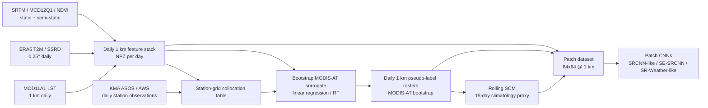
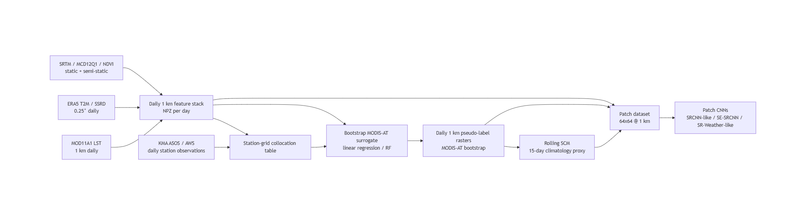
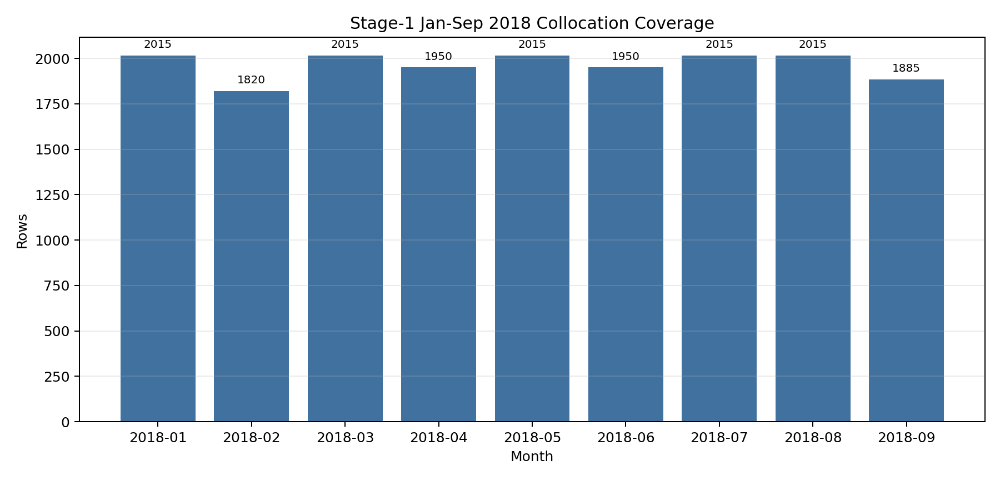
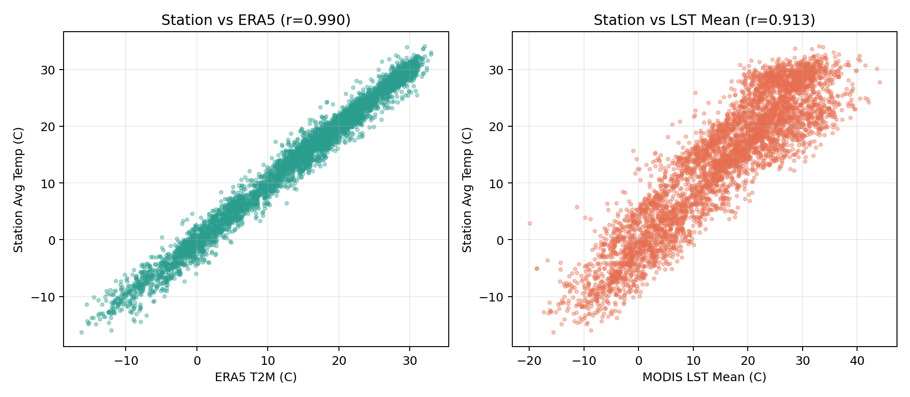
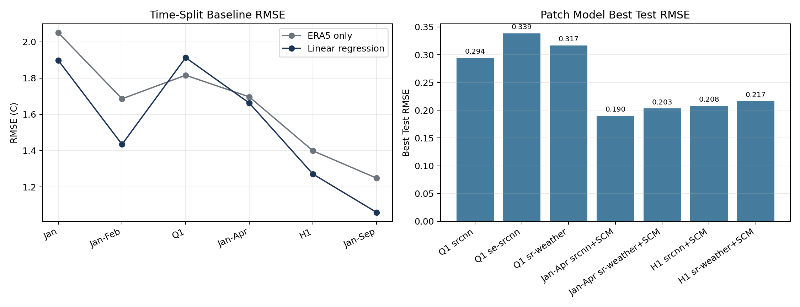

# Stage 1 现有数据-模型流程总览

更新时间: `2026-04-07`

这份文档的目标不是复述论文原文，而是把我们当前已经搭起来的 `Stage 1` 复现链条讲清楚:

1. 现在手里到底有哪些数据。
2. 每一层模型的输入输出是什么。
3. 空间尺度、时间尺度是怎样传递的。
4. 当前结果说明了什么，离论文完整版还差什么。

---

## 1. 一句话理解当前这套复现

当前我们已经把论文的 `Stage 1` 拆成了 4 层:

1. 原始遥感/再分析/站点数据层
2. 日尺度 `1 km` 特征栈层
3. 站点对齐与 `MODIS-AT bootstrap` 伪标签层
4. patch 级超分模型层

它的核心思想可以概括成一句话:

**先用站点温度把 `ERA5 + MODIS + 地形/地表因子` 拟合成一个 `1 km` 日尺度空气温度伪标签，再用这个伪标签去训练更接近论文的空间超分模型。**

---

## 2. 当前流程图

---

## 3. 当前已有数据

### 3.1 原始数据源

| 数据 | 当前用途 | 空间尺度 | 时间尺度 | 当前状态 |
| --- | --- | --- | --- | --- |
| `MOD11A1 v061` | 白天/夜间 LST 主输入 | `1 km` | `daily` | 已处理到 `2018-09-30` |
| `ERA5 daily t2m` | 低分辨率温度主输入 | `0.25°` | `daily` | 已处理到 `2018-09-30` |
| `ERA5 daily ssrd` | 太阳辐射辅助变量 | `0.25°` | `daily` | 已处理到 `2018-09-30` |
| `SRTMGL1` | `DEM / slope / aspect` | 原始 `30 m`，当前统一到 `1 km` 使用 | `static` | 已完成 |
| `MCD12Q1` | `land cover / imp_proxy` | 原始 `500 m`，当前统一到 `1 km` 使用 | `annual/static` | 已完成 |
| `MOD13A2` | `NDVI` 辅助变量 | `1 km` | `16-day composite` | 已处理到 `2018-09` |
| `KMA ASOS / AWS` | 站点目标与验证 | 站点点位 | `daily` | 当前已整理出 `65` 站、`2018-01~09` |

### 3.2 当前主数据覆盖范围

当前最完整的一套 Stage 1 表是:

- 时间: `2018-01-01` 到 `2018-09-30`
- 站点: `65`
- collocation 行数: `17680`
- 日尺度标准特征栈: `272` 个 `npz`

主表路径:

- [stage1_station_collocations_2018_01.csv](/E:/18664-C5F119/华为家庭存储/CUBD/Research/HXGG2025-6-2/hxgg2025-6-2/25to1/data/stage1/processed/station_collocations_full65_jansep/stage1_station_collocations_2018_01.csv)
- [stage1_station_collocations_2018_01_summary.json](/E:/18664-C5F119/华为家庭存储/CUBD/Research/HXGG2025-6-2/hxgg2025-6-2/25to1/data/stage1/processed/station_collocations_full65_jansep/stage1_station_collocations_2018_01_summary.json)
- [stage1_overview_summary.json](/E:/18664-C5F119/华为家庭存储/CUBD/Research/HXGG2025-6-2/hxgg2025-6-2/25to1/reports/stage1_overview/stage1_overview_summary.json)

---

## 4. 每一层的输入输出

## 4.1 日尺度 `1 km` 特征栈

这是当前最关键的中间层。每一天对应一个 `npz` 文件，代表韩国范围 `1 km` 网格上的多通道特征。

典型路径:

- [A2018001.npz](/E:/18664-C5F119/华为家庭存储/CUBD/Research/HXGG2025-6-2/hxgg2025-6-2/25to1/data/stage1/processed/stage1_simplified_features/A2018001.npz)

当前字段包括:

- `era5_t2m_c`
- `dem_m`
- `slope_deg`
- `aspect_deg`
- `imp_proxy`
- `lc_type1_majority`
- `lst_day_c`
- `lst_night_c`
- `lst_mean_c`
- `ndvi`
- `solar_incoming_j_m2_day`
- `solar_incoming_w_m2`
- `qc_day`
- `qc_night`
- `valid_day`
- `valid_night`
- `valid_mean`
- 当前部分版本还已并入 `scm_bootstrap_c`

这层的本质是:

**把所有时变/静态变量都投到同一张 `1 km` 日网格上，为后续站点对齐、伪标签拟合和 patch 训练提供统一输入。**

## 4.2 站点对齐表 `collocation`

这一层把“站点温度”与“同日期、同位置的格点特征”接在一起，形成监督学习表。

输入:

- KMA 站点日观测
- 对应日期的 `1 km` 特征栈
- 站点经纬度与高程

输出:

- 一行 = `某站点 × 某一天`

关键字段:

- 目标:
  - `station_avg_temp_c`
  - `station_min_temp_c`
  - `station_max_temp_c`
- 网格特征:
  - `era5_t2m_c`
  - `lst_mean_c`
  - `ndvi`
  - `solar_incoming_w_m2`
  - `dem_m`
  - `imp_proxy`
  - 其他静态/质量控制字段

这层的本质是:

**把“遥感/再分析输入”变成一个可以监督训练的表格问题。**

## 4.3 `MODIS-AT bootstrap` 伪标签模型

这是当前最重要的“标签构造近似层”。

输入:

- `collocation` 表中的格点特征

输出:

- 对站点均温的拟合模型
- 以及推理到整张 `1 km` 日网格后的伪标签栅格

当前主模型:

- `linear_regression`

当前最新一版训练:

- 训练数据: `2018-01-01` 到 `2018-06-30`
- 输出目录: [modis_at_bootstrap_jansep_janh1train](/E:/18664-C5F119/华为家庭存储/CUBD/Research/HXGG2025-6-2/hxgg2025-6-2/25to1/data/stage1/processed/modis_at_bootstrap_jansep_janh1train)
- 训练摘要: [training_summary.json](/E:/18664-C5F119/华为家庭存储/CUBD/Research/HXGG2025-6-2/hxgg2025-6-2/25to1/data/stage1/models/modis_at_bootstrap_jansep_janh1train/training_summary.json)

这层的本质是:

**把站点监督信息扩散成整张 `1 km` 日尺度空间场。**

## 4.4 `SCM` 近似图

`SCM` 是论文最关键的高分辨率先验之一。我们当前用的是 `bootstrap` 近似版。

输入:

- 每天的 `MODIS-AT bootstrap` 伪标签栅格

输出:

- `rolling 15-day SCM`
- 本质上是一个短时间窗平滑后的空间气候态图

作用:

- 给 patch 模型一个“这一天附近通常哪里偏暖、哪里偏冷”的空间先验

## 4.5 Patch 级超分模型

这一层才是最接近论文 `SR-Weather` 思想的空间超分阶段。

输入:

- `64 x 64` 的 `1 km` patch
- 输入通道是多变量堆叠
- 当前通道包括:
  - `era5_t2m_c`
  - `dem_m`
  - `slope_deg`
  - `imp_proxy`
  - `lc_type1_majority`
  - `lst_day_c`
  - `lst_night_c`
  - `lst_mean_c`
  - `scm_bootstrap_c`
  - `ndvi`
  - `solar_incoming_w_m2`
  - `valid_day`
  - `valid_night`
  - `valid_mean`
  - `aspect_sin`
  - `aspect_cos`

输出:

- 同尺寸 `64 x 64` 的温度 patch

当前实现结构:

- `srcnn_like`
- `se_srcnn`
- `sr_weather_like`

对应训练脚本:

- [train_stage1_patch_cnn.py](/E:/18664-C5F119/华为家庭存储/CUBD/Research/HXGG2025-6-2/hxgg2025-6-2/25to1/scripts/train_stage1_patch_cnn.py)

---

## 5. 空间尺度与时间尺度

| 层级 | 输入空间尺度 | 输出空间尺度 | 时间尺度 | 说明 |
| --- | --- | --- | --- | --- |
| ERA5 输入 | `0.25°` | 重投影到 `1 km` 特征网格 | `daily` | 低分辨率温度/辐射背景场 |
| MODIS LST | `1 km` | `1 km` | `daily` | 高分辨率热力纹理 |
| NDVI | `1 km` | `1 km` | `16-day` composite，再映射到日尺度 | 反映植被季节性 |
| DEM / slope / aspect | `1 km` 使用 | `1 km` | `static` | 地形先验 |
| land cover / imp | `1 km` 使用 | `1 km` | `static` / `annual` | 地表类型和城市化强度 |
| collocation | 站点点位 + `1 km` 像元 | 表格行 | `daily` | 用于监督拟合 |
| bootstrap label | `1 km` 多通道日网格 | `1 km` 温度栅格 | `daily` | 伪标签层 |
| SCM | `1 km` 日伪标签 | `1 km` 气候态图 | `rolling 15-day` | 空间先验 |
| patch CNN | `64 x 64 @ 1 km` | `64 x 64 @ 1 km` | `daily patch` | 空间重建层 |

---

## 6. 当前几类模型分别在做什么

## 6.1 站点 baseline

作用:

- 判断“现有特征是否比直接用 `ERA5` 更有信息”

输入:

- `collocation` 表格特征

输出:

- `station_avg_temp_c`

当前最稳定的观察是:

- 直接 `ERA5` 已经很强
- 但加入 `LST + 地形 + NDVI + solar + imp` 后，仍然能进一步下降误差

## 6.2 伪标签模型

作用:

- 把站点监督推广到全图

输入:

- 站点对齐表

输出:

- `1 km` 每日温度伪标签栅格

它是当前替代论文中 `MODIS-derived air temperature` 的工程化近似。

## 6.3 `SRCNN-like`

作用:

- 当前最简单也最稳的 patch 基线

特点:

- 结构浅
- 容易训练
- 在我们现阶段数据上经常是最强基线

## 6.4 `SE-SRCNN`

作用:

- 模拟论文前身模型里的 `SE attention`

特点:

- 在当前 bootstrap 设置下表现通常不如 `srcnn_like`

## 6.5 `SR-Weather-like`

作用:

- 模拟论文核心思想: 用 `avg / max / min pooling` 风格 gate 来利用高分辨率先验

特点:

- 比 `SE-SRCNN` 更接近论文的 attention 思路
- 在当前实现里通常接近但略弱于 `srcnn_like`
- 当 `SCM` 时间基线变长时，表现会更像回事

---

## 7. 当前最重要的量化结论

## 7.1 时间外推 baseline 已经稳定

最新 `Jan-Jun -> Jul-Sep` 时间切分结果:

- 文件: [metrics_summary.json](/E:/18664-C5F119/华为家庭存储/CUBD/Research/HXGG2025-6-2/hxgg2025-6-2/25to1/data/stage1/models/station_baseline_full65_jansep/time_split_janh1_train_q3_test/metrics_summary.json)
- `ERA5 only`: `RMSE 1.249`
- `linear_regression`: `RMSE 1.060`

这说明:

**当前特征栈不仅能拟合冬春，还能较稳定地外推到夏季。**

## 7.2 空间泛化也比较健康

`holdout station 108`:

- 文件: [metrics_summary.json](/E:/18664-C5F119/华为家庭存储/CUBD/Research/HXGG2025-6-2/hxgg2025-6-2/25to1/data/stage1/models/station_baseline_full65_jansep/holdout_station_108/metrics_summary.json)
- `ERA5 only`: `RMSE 1.251`
- `linear_regression`: `RMSE 0.908`

这说明:

**当前输入特征不只是“记住时间趋势”，也确实携带一些可泛化的空间信息。**

## 7.3 特征关系上，`ERA5` 仍是最强底座，`LST` 是补充纹理信息

在当前 `Jan-Sep` 主表上:

- `station_avg_temp_c` 与 `era5_t2m_c` 的相关系数约 `0.990`
- `station_avg_temp_c` 与 `lst_mean_c` 的相关系数约 `0.913`

这很好理解:

- `ERA5` 提供大尺度温度背景
- `MODIS LST` 提供更细的局地热力纹理
- 二者不是谁替代谁，而是“背景场 + 细节场”的关系

## 7.4 patch 模型已经能做稳定对比

当前比较有代表性的 patch 结果:

- `Q1 split-aware`:
  - `srcnn_like`: `RMSE 0.294`
  - `se_srcnn`: `RMSE 0.339`
  - `sr_weather_like`: `RMSE 0.317`
- `Jan-Apr + rolling SCM`:
  - `srcnn_like`: `RMSE 0.190`
  - `sr_weather_like`: `RMSE 0.203`
- `H1 + rolling SCM`:
  - `srcnn_like`: `RMSE 0.208`
  - `sr_weather_like`: `RMSE 0.217`

最值得记住的判断是:

**目前不是网络越复杂越好，而是 `SCM` 和伪标签质量对结果影响更大。**

---

## 8. 图表辅助理解

## 8.1 月度样本覆盖

读图建议:

- 每个月大约都在 `1900~2015` 行之间
- 说明 `65` 站的日尺度对齐已经比较稳定
- `2 月 / 4 月 / 6 月 / 9 月` 稍少，主要是日数差异和局部缺测

## 8.2 目标与关键输入的关系

读图建议:

- 左图更紧，说明 `ERA5` 是最稳定的大尺度温度底座
- 右图更散，说明 `LST` 能提供局地信息，但也更容易受云、地表状况和昼夜热惯性影响

## 8.3 模型效果随时间基线扩展的变化

读图建议:

- 左图说明随着时间范围从 `Jan` 扩到 `Jan-Sep`，线性模型整体越来越稳
- `Q1` 那个点曾经出现 `linear` 不如 `ERA5`，说明跨季节迁移一开始确实很难
- 右图说明 patch 层目前依然是 `srcnn_like` 更稳，但 `sr_weather_like` 已经具备比较价值

---

## 9. 当前离论文完整版还差什么

当前我们已经比较完整地复现了论文的 **工程骨架**，但还没有完全达到论文的 **最终定义**。

主要差距有 4 个:

1. 当前标签还是 `bootstrap MODIS-AT`，不是论文那套正式 `MODIS-derived air temperature` 构造。
2. 当前 `SCM` 是短时间窗近似，不是论文使用的 `2000-2020` 长时段气候态构造。
3. 当前 patch 模型是 `SR-Weather-like`，还不是逐层完全对齐论文实现。
4. 当前重点仍在 `Stage 1`，`Stage 2` 的 `FuXi -> 1 km` 还没正式展开。

---

## 10. 你现在应该怎样理解这套系统

如果只抓主线，可以这样记:

1. `ERA5` 负责给出当天的大尺度温度背景。
2. `MODIS LST + NDVI + DEM + imp + solar` 负责告诉模型“局地为什么会比周围更热或更冷”。
3. 站点数据把这些输入变成可监督的温度目标。
4. `MODIS-AT bootstrap` 把点监督扩展成面监督。
5. `SCM` 进一步给 patch 模型提供“季节性空间先验”。
6. 最后的 patch CNN 负责学习 `1 km` 空间纹理重建，而不只是做一个表格回归。

如果你接下来要继续深入，最建议优先理解 3 个文件:

- [sr_weather_reproduction_notes.md](/E:/18664-C5F119/华为家庭存储/CUBD/Research/HXGG2025-6-2/hxgg2025-6-2/25to1/sr_weather_reproduction_notes.md)
- [stage1_baseline_results.md](/E:/18664-C5F119/华为家庭存储/CUBD/Research/HXGG2025-6-2/hxgg2025-6-2/25to1/stage1_baseline_results.md)
- [stage1_patch_training_results.md](/E:/18664-C5F119/华为家庭存储/CUBD/Research/HXGG2025-6-2/hxgg2025-6-2/25to1/stage1_patch_training_results.md)

