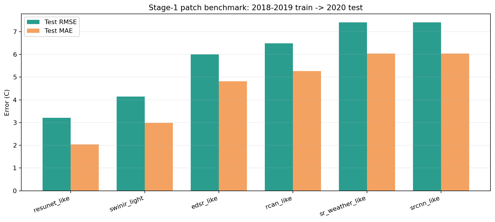

# Stage-1 Patch Benchmark

更新时间: `2026-04-10`

## Scope

这轮 benchmark 在同一套 patch 数据上比较了 6 个模型：

- `srcnn_like`
- `sr_weather_like`
- `edsr_like`
- `rcan_like`
- `resunet_like`
- `swinir_light`

统一设置是：

- patch index: [stage1_patch_index_summary.json](/E:/18664-C5F119/华为家庭存储/CUBD/Research/HXGG2025-6-2/hxgg2025-6-2/25to1/data/stage1/processed/stage1_patch_index_2018_2020full_daily5_ps64_s64_v50/stage1_patch_index_summary.json)
- 数据划分: `2018-2019 train -> 2020 test`
- `SCM` 字段: `scm_paperlike_2018_2020_c`
- 训练方式: `--no-train-shuffle`
- 训练轮数: `2 epochs`

需要说明的边界是：

- 这是一轮 **quick-run benchmark**
- 各模型用了更合理但不完全相同的 `batch_size / lr`
- 所以它最适合做“筛模型”，还不是最终公平到极致的论文级对比

## Result Table

完整汇总在 [benchmark_metrics.json](/E:/18664-C5F119/华为家庭存储/CUBD/Research/HXGG2025-6-2/hxgg2025-6-2/25to1/reports/stage1_patch_benchmark_20260410/benchmark_metrics.json)。

按 `test RMSE` 排序：

1. `resunet_like`: `RMSE 3.209`, `MAE 2.034`
2. `swinir_light`: `RMSE 4.148`, `MAE 2.988`
3. `edsr_like`: `RMSE 5.995`, `MAE 4.812`
4. `rcan_like`: `RMSE 6.481`, `MAE 5.265`
5. `sr_weather_like`: `RMSE 7.406`, `MAE 6.038`
6. `srcnn_like`: `RMSE 7.407`, `MAE 6.038`

相对 `srcnn_like` 的 `RMSE` 改善幅度：

- `resunet_like`: `56.7%`
- `swinir_light`: `44.0%`
- `edsr_like`: `19.1%`
- `rcan_like`: `12.5%`
- `sr_weather_like`: 基本持平

图表在这里：

## Per-model Files

- `srcnn_like`: [training_summary.json](/E:/18664-C5F119/华为家庭存储/CUBD/Research/HXGG2025-6-2/hxgg2025-6-2/25to1/data/stage1/models/stage1_patch_cnn_scmpaperlike_2018_2019train_2020test_daily5_ps64_s64_v50_ordered/training_summary.json)
- `sr_weather_like`: [training_summary.json](/E:/18664-C5F119/华为家庭存储/CUBD/Research/HXGG2025-6-2/hxgg2025-6-2/25to1/data/stage1/models/stage1_patch_sr_weather_like_scmpaperlike_2018_2019train_2020test_daily5_ps64_s64_v50_ordered/training_summary.json)
- `edsr_like`: [training_summary.json](/E:/18664-C5F119/华为家庭存储/CUBD/Research/HXGG2025-6-2/hxgg2025-6-2/25to1/data/stage1/models/stage1_patch_edsr_like_scmpaperlike_2018_2019train_2020test_daily5_ps64_s64_v50/training_summary.json)
- `rcan_like`: [training_summary.json](/E:/18664-C5F119/华为家庭存储/CUBD/Research/HXGG2025-6-2/hxgg2025-6-2/25to1/data/stage1/models/stage1_patch_rcan_like_scmpaperlike_2018_2019train_2020test_daily5_ps64_s64_v50/training_summary.json)
- `resunet_like`: [training_summary.json](/E:/18664-C5F119/华为家庭存储/CUBD/Research/HXGG2025-6-2/hxgg2025-6-2/25to1/data/stage1/models/stage1_patch_resunet_like_scmpaperlike_2018_2019train_2020test_daily5_ps64_s64_v50/training_summary.json)
- `swinir_light`: [training_summary.json](/E:/18664-C5F119/华为家庭存储/CUBD/Research/HXGG2025-6-2/hxgg2025-6-2/25to1/data/stage1/models/stage1_patch_swinir_light_scmpaperlike_2018_2019train_2020test_daily5_ps64_s64_v50/training_summary.json)

## Interpretation

这轮结果有 4 个很强的信号：

1. **多尺度上下文是当前最值钱的建模能力。**  
`resunet_like` 直接把 `RMSE` 从 `7.41` 拉到 `3.21`，而且 `train/test` gap 不大，说明它不是简单过拟合，而是真的更适合这个任务。

2. **Transformer 是有潜力的，但不一定先于 U-Net。**  
`swinir_light` 也明显优于原 baseline，但还是输给 `resunet_like`。这说明当前数据和标签条件下，“稳定的多尺度 CNN”比“轻量窗口注意力”更吃香。

3. **深残差 CNN 有价值，但不如多尺度结构。**  
`edsr_like` 和 `rcan_like` 都明显好于 `srcnn_like`，说明更深的 CNN 确实有用；但它们和 `resunet_like` 的差距也很大，说明问题不只是“网络太浅”，而是“上下文不够”。

4. **当前的 `sr_weather_like` 在这套 pipeline 下已经不再是最强结构。**  
它和 `srcnn_like` 几乎打平，说明现在的主优势并不来自那套轻量 pooling-gate 本身，而是更大的多尺度建模能力。

## Priority Reset

基于这轮结果，模型优先级应该更新成：

1. `resunet_like`
2. `swinir_light`
3. `edsr_like`
4. `rcan_like`
5. `sr_weather_like`
6. `srcnn_like`

也就是说，下一轮重点不该再是围着 `srcnn_like / sr_weather_like` 小修小补，而应该把资源放到：

- `resunet_like` 的正式复跑
- `swinir_light` 的稳定化训练
- 然后再补一个更强 transformer 对照，比如 `hat_tiny`

## Recommended Next Step

我建议下一步直接做这 3 件事：

1. 用 `10-20` epoch 正式重跑 `resunet_like`
2. 用 warmup / 更低学习率正式重跑 `swinir_light`
3. 新增 `hat_tiny`，作为 transformer 主线的下一档对照

如果只选一个立刻继续，我会优先推 `resunet_like`，因为它现在已经是最强、最稳、最像当前问题正确 inductive bias 的模型。
