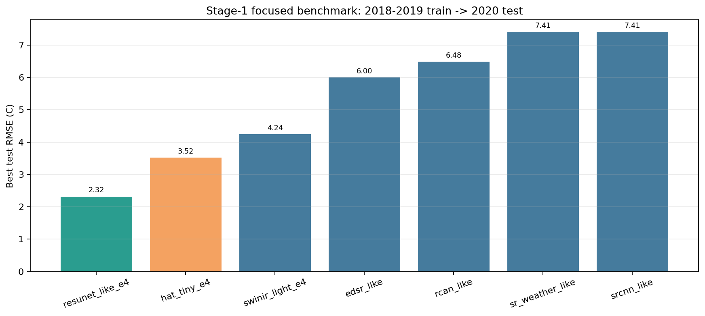

# Stage-1 Focused Patch Benchmark

更新时间: `2026-04-10`

## Scope

这轮是在上一份 [stage1_patch_benchmark_20260410.md](/E:/18664-C5F119/华为家庭存储/CUBD/Research/HXGG2025-6-2/hxgg2025-6-2/25to1/stage1_patch_benchmark_20260410.md) 基础上，继续对最值得投入的 3 条线做更正式复跑：

- `resunet_like`
- `swinir_light`
- `hat_tiny`

统一任务仍然是：

- patch index: [stage1_patch_index_summary.json](/E:/18664-C5F119/华为家庭存储/CUBD/Research/HXGG2025-6-2/hxgg2025-6-2/25to1/data/stage1/processed/stage1_patch_index_2018_2020full_daily5_ps64_s64_v50/stage1_patch_index_summary.json)
- 数据划分: `2018-2019 train -> 2020 test`
- `SCM` 字段: `scm_paperlike_2018_2020_c`
- 训练方式: `--no-train-shuffle`

这次把训练轮数从 `2` 提到了 `4`，目标是看排序是否稳定，而不是只看两轮 quick-run 的偶然波动。

## New Model Added

这轮新增并实际跑通了 `hat_tiny`，代码已经接入 [train_stage1_patch_cnn.py](/E:/18664-C5F119/华为家庭存储/CUBD/Research/HXGG2025-6-2/hxgg2025-6-2/25to1/scripts/train_stage1_patch_cnn.py)。

这里的 `hat_tiny` 是一个**轻量 HAT 风格 hybrid attention 版本**：

- `window attention`
- `shift window`
- `conv attention branch`
- `MLP`

它不是论文原版 HAT 的完整逐层复刻，但已经保留了“transformer attention + convolutional attention”的混合思路，足够作为当前 Stage-1 的第一版 HAT 主线对照。

对应 smoke 自检结果在 [training_summary.json](/E:/18664-C5F119/华为家庭存储/CUBD/Research/HXGG2025-6-2/hxgg2025-6-2/25to1/data/stage1/models/smoke_models_20260410/hat_tiny_lr2e4/training_summary.json)。

## Result Table

完整汇总见 [benchmark_metrics.json](/E:/18664-C5F119/华为家庭存储/CUBD/Research/HXGG2025-6-2/hxgg2025-6-2/25to1/reports/stage1_patch_benchmark_focus_20260410/benchmark_metrics.json)。

按 `best test RMSE` 排序：

1. `resunet_like_e4`: `RMSE 2.319`, `MAE 1.278`
2. `hat_tiny_e4`: `RMSE 3.521`, `MAE 2.401`
3. `swinir_light_e4`: `RMSE 4.242`, `MAE 3.091`
4. `edsr_like`: `RMSE 5.995`, `MAE 4.812`
5. `rcan_like`: `RMSE 6.481`, `MAE 5.265`
6. `sr_weather_like`: `RMSE 7.406`, `MAE 6.038`
7. `srcnn_like`: `RMSE 7.407`, `MAE 6.038`

相对 `srcnn_like` 的 `RMSE` 改善幅度：

- `resunet_like_e4`: `68.7%`
- `hat_tiny_e4`: `52.5%`
- `swinir_light_e4`: `42.7%`
- `edsr_like`: `19.1%`
- `rcan_like`: `12.5%`

图表在这里：

## Per-model Files

- `resunet_like_e4`: [training_summary.json](/E:/18664-C5F119/华为家庭存储/CUBD/Research/HXGG2025-6-2/hxgg2025-6-2/25to1/data/stage1/models/stage1_patch_resunet_like_scmpaperlike_2018_2019train_2020test_daily5_ps64_s64_v50_e4/training_summary.json)
- `swinir_light_e4`: [training_summary.json](/E:/18664-C5F119/华为家庭存储/CUBD/Research/HXGG2025-6-2/hxgg2025-6-2/25to1/data/stage1/models/stage1_patch_swinir_light_scmpaperlike_2018_2019train_2020test_daily5_ps64_s64_v50_e4/training_summary.json)
- `hat_tiny_e4`: [training_summary.json](/E:/18664-C5F119/华为家庭存储/CUBD/Research/HXGG2025-6-2/hxgg2025-6-2/25to1/data/stage1/models/stage1_patch_hat_tiny_scmpaperlike_2018_2019train_2020test_daily5_ps64_s64_v50_e4/training_summary.json)

## Interpretation

这轮结果已经把“下一步该押哪条线”讲得很清楚了。

### 1. `resunet_like` 现在是明确的第一名

它不仅继续保持领先，而且从 `2 epoch` 到 `4 epoch` 还在稳定变好：

- `2 epoch`: `RMSE 3.209`
- `4 epoch`: `RMSE 2.319`

这说明它不是“碰巧第一”，而是真正抓住了这个问题最重要的 inductive bias：

- 多尺度上下文
- 地形/城市/季节空间结构
- 平滑温度场中的局地差异

### 2. `hat_tiny` 已经证明比 `swinir_light` 更值得继续投

`2 epoch` 版本我们还没有 `hat`，只看到 `swinir_light` 有潜力；  
现在 `4 epoch` 后，`hat_tiny` 已经把 `swinir_light` 压过去了：

- `hat_tiny_e4`: `RMSE 3.521`
- `swinir_light_e4`: `RMSE 4.242`

这说明：

- transformer 这条线值得继续
- 但“纯窗口注意力”不是最优
- `hybrid attention` 比较符合当前任务

### 3. `SR-Weather-like` 在当前 pipeline 下已经不是主力

它和 `srcnn_like` 基本打平，说明在现在这套数据与标签条件下，单纯复用轻量 pooling-gate 设计并不能形成竞争力。

这不代表论文方向错了，而是说明：

- 当前 pipeline 和论文原始 `LR -> HR` 几何并不完全一致
- 当前最主要收益来自“更强上下文建模”，不是“小型定制 gate”

## Priority Reset

基于这轮结果，当前最合理的模型优先级应该更新为：

1. `resunet_like`
2. `hat_tiny`
3. `swinir_light`
4. `edsr_like`
5. `rcan_like`
6. `sr_weather_like`
7. `srcnn_like`

## Recommended Next Step

如果继续往下做，我建议按这个顺序推进：

1. 对 `resunet_like` 做更正式的长轮数训练
2. 对 `hat_tiny` 做更正式的长轮数训练
3. 如果这两条线结果稳定，再决定是否继续补更完整的 `HAT` 或更深 `ResUNet`

一句话总结：

**当前 Stage-1 最值得押的两条线，已经从“论文原始轻量 CNN 变体”切换成了 `ResUNet` 和 `HAT` 风格 hybrid attention。**
