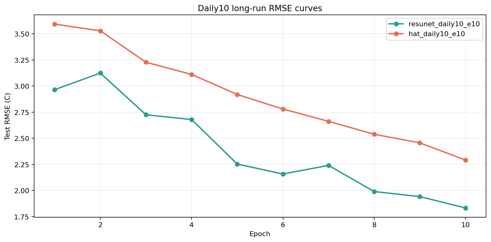

# Stage-1 Daily10 Long-run Benchmark

更新时间: `2026-04-13`

## Scope

这份报告是当前 patch 模型阶段性的收口版本。  
目标很明确：在更大 patch 覆盖率 `daily10` 上，把当前两条主线都拉到 `10 epoch`，确认排序是否稳定。

对象：

- `resunet_like`
- `hat_tiny`

数据设置：

- patch index: [stage1_patch_index_summary.json](/E:/18664-C5F119/华为家庭存储/CUBD/Research/HXGG2025-6-2/hxgg2025-6-2/25to1/data/stage1/processed/stage1_patch_index_2018_2020full_daily10_ps64_s64_v50/stage1_patch_index_summary.json)
- `2018-2019 train -> 2020 test`
- `7300 train / 3660 test`
- `SCM`: `scm_paperlike_2018_2020_c`

## Results

汇总在 [daily10_longrun_metrics.json](/E:/18664-C5F119/华为家庭存储/CUBD/Research/HXGG2025-6-2/hxgg2025-6-2/25to1/reports/stage1_patch_longrun_daily10_20260413/daily10_longrun_metrics.json)。

### `resunet_like`

- 结果文件: [training_summary.json](/E:/18664-C5F119/华为家庭存储/CUBD/Research/HXGG2025-6-2/hxgg2025-6-2/25to1/data/stage1/models/stage1_patch_resunet_like_scmpaperlike_2018_2019train_2020test_daily10_ps64_s64_v50_e10/training_summary.json)
- best epoch: `10`
- best test `MAE 1.062`
- best test `RMSE 1.833`

### `hat_tiny`

- 结果文件: [training_summary.json](/E:/18664-C5F119/华为家庭存储/CUBD/Research/HXGG2025-6-2/hxgg2025-6-2/25to1/data/stage1/models/stage1_patch_hat_tiny_scmpaperlike_2018_2019train_2020test_daily10_ps64_s64_v50_e10/training_summary.json)
- best epoch: `10`
- best test `MAE 1.239`
- best test `RMSE 2.291`

对应 RMSE 曲线在：

## Comparison To Previous Runs

和前几轮相比：

### `resunet_like`

- `daily5 e10`: `RMSE 2.298`
- `daily10 e6`: `RMSE 2.426`
- `daily10 e10`: `RMSE 1.833`

### `hat_tiny`

- `daily5 e10`: `RMSE 3.786`
- `daily10 e6`: `RMSE 2.661`
- `daily10 e10`: `RMSE 2.291`

## Interpretation

这轮结论已经足够明确。

### 1. `resunet_like` 是当前 Stage-1 的主模型

它不仅在所有已跑配置里持续第一，而且随着：

- 样本覆盖增加
- 训练轮数增加

性能还在继续提升。  
`daily10 e10` 把 test `RMSE` 压到了 `1.833`，这是目前所有 patch 模型里最好的结果。

### 2. `hat_tiny` 是当前最好的 transformer / hybrid-attention 对照

它从 `daily5 e10` 到 `daily10 e10` 提升很明显：

- `3.786 -> 2.291`

这说明它确实比 `swinir_light` 更适合作为当前 transformer 主线。  
但和 `ResUNet` 比，仍然存在稳定差距。

### 3. 当前主线已经足够清晰

现在不需要再继续扩一批新骨干去找方向了。  
方向已经足够清楚：

- 第一主线: `resunet_like`
- 第二主线: `hat_tiny`

## Decision

当前阶段正式建议：

1. 用 `resunet_like` 作为 Stage-1 主结果模型
2. 用 `hat_tiny` 作为 transformer / hybrid-attention 主对照
3. 其余 `srcnn_like / sr_weather_like / edsr_like / rcan_like / swinir_light` 保留为辅助 benchmark

## Next Step

如果继续推进，最合理的下一步不是再找新模型，而是：

1. 围绕 `resunet_like` 做更正式训练与评估沉淀
2. 用 `hat_tiny` 保持结构对照
3. 把这两条线接回更完整的 Stage-1 报告和论文对照叙事

一句话结论：

**当前 Stage-1 patch 主线已经收敛：`ResUNet` 是主模型，`HAT-tiny` 是第二主线。**
