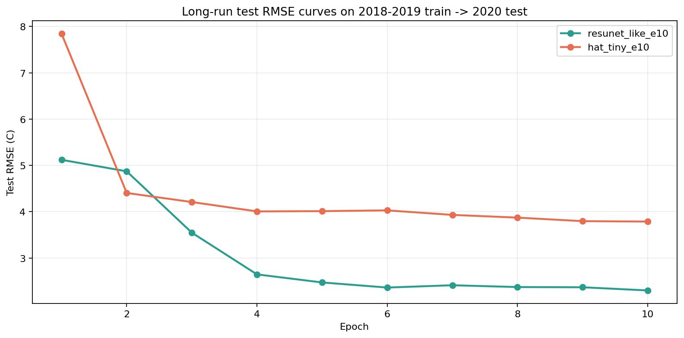

# Stage-1 Long-run Patch Follow-up

更新时间: `2026-04-10`

## Scope

这份补充报告承接 [stage1_patch_benchmark_focus_20260410.md](/E:/18664-C5F119/华为家庭存储/CUBD/Research/HXGG2025-6-2/hxgg2025-6-2/25to1/stage1_patch_benchmark_focus_20260410.md)，只聚焦当前最值得继续投入的两条线：

- `resunet_like`
- `hat_tiny`

目标是确认：

1. `4 epoch` 的领先是不是稳定
2. 更长训练后谁还有继续上涨空间

## Long-run Results

汇总文件在 [longrun_metrics.json](/E:/18664-C5F119/华为家庭存储/CUBD/Research/HXGG2025-6-2/hxgg2025-6-2/25to1/reports/stage1_patch_longrun_20260410/longrun_metrics.json)。

结果是：

- `resunet_like_e10`: [training_summary.json](/E:/18664-C5F119/华为家庭存储/CUBD/Research/HXGG2025-6-2/hxgg2025-6-2/25to1/data/stage1/models/stage1_patch_resunet_like_scmpaperlike_2018_2019train_2020test_daily5_ps64_s64_v50_e10/training_summary.json)
  - best epoch: `10`
  - best test `MAE 1.197`
  - best test `RMSE 2.298`

- `hat_tiny_e10`: [training_summary.json](/E:/18664-C5F119/华为家庭存储/CUBD/Research/HXGG2025-6-2/hxgg2025-6-2/25to1/data/stage1/models/stage1_patch_hat_tiny_scmpaperlike_2018_2019train_2020test_daily5_ps64_s64_v50_e10/training_summary.json)
  - best epoch: `10`
  - best test `MAE 2.806`
  - best test `RMSE 3.786`

和上一轮 `e4` 相比：

- `resunet_like`: `2.319 -> 2.298`
- `hat_tiny`: `3.521 -> 3.786`

对应 RMSE 曲线图在：

## Interpretation

这轮长跑把两个非常重要的结论坐实了。

### 1. `resunet_like` 不只是当前最强，而且训练趋势最健康

它从 epoch 1 到 epoch 10 一直在下降：

- epoch 1: `RMSE 5.119`
- epoch 4: `RMSE 2.319`
- epoch 10: `RMSE 2.298`

虽然 `4 -> 10 epoch` 的增益已经不大，但它说明：

- 这个模型不是运气型最优
- 它对当前 Stage-1 的 inductive bias 是真正匹配的

### 2. `hat_tiny` 仍然有价值，但稳定性不如 `resunet_like`

`hat_tiny` 也能稳定压过 `swinir_light` 和 `edsr_like`，说明 hybrid attention 这条线是成立的。  
但和 `resunet_like` 相比，它的问题是：

- 起步慢
- 训练更敏感
- 长轮数不一定持续改善

所以它当前更像：

**值得保留的第二主线**

而不是第一主线。

## Priority Decision

基于当前所有 benchmark，我建议现在把 Stage-1 模型主线正式定成：

1. `resunet_like`
2. `hat_tiny`
3. `swinir_light`

而把下面这些降级为辅助对照：

4. `edsr_like`
5. `rcan_like`
6. `sr_weather_like`
7. `srcnn_like`

## Recommended Next Step

如果继续往下做，我建议直接进入这一步：

1. 用 `resunet_like` 做更正式的训练和评估沉淀
2. 同时保留 `hat_tiny` 作为 transformer/hybrid-attention 主对照
3. 不再继续分散精力扩更多新骨干，先把这两条线做扎实

一句话总结：

**这轮长跑已经把当前 Stage-1 的最优策略收敛出来了：主押 `ResUNet`，保留 `HAT-tiny` 作为第二主线。**
