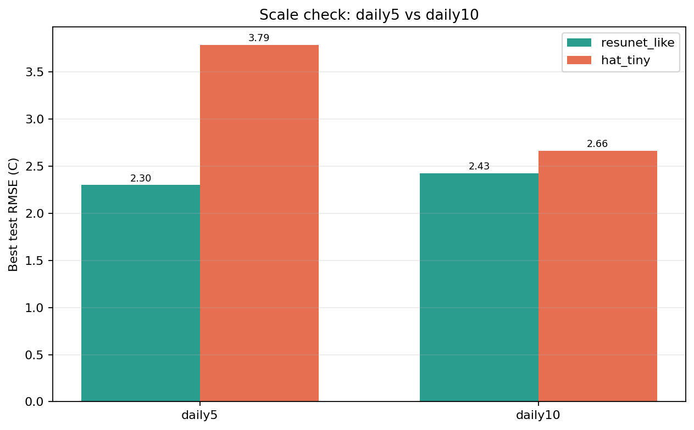

# Stage-1 Patch Scale Check

更新时间: `2026-04-13`

## Scope

这轮不是继续扩新模型，而是检查当前两条主线在**更大 patch 覆盖率**下是否仍然保持同样排序。

比较对象：

- `resunet_like`
- `hat_tiny`

比较设置：

- `daily5`: 每天保留约 `5` 个 patch
- `daily10`: 每天保留约 `10` 个 patch

对应 patch index：

- `daily5`: [stage1_patch_index_summary.json](/E:/18664-C5F119/华为家庭存储/CUBD/Research/HXGG2025-6-2/hxgg2025-6-2/25to1/data/stage1/processed/stage1_patch_index_2018_2020full_daily5_ps64_s64_v50/stage1_patch_index_summary.json)
- `daily10`: [stage1_patch_index_summary.json](/E:/18664-C5F119/华为家庭存储/CUBD/Research/HXGG2025-6-2/hxgg2025-6-2/25to1/data/stage1/processed/stage1_patch_index_2018_2020full_daily10_ps64_s64_v50/stage1_patch_index_summary.json)

规模差异：

- `daily5`: `3650 train / 1830 test`
- `daily10`: `7300 train / 3660 test`

## Results

汇总在 [scalecheck_metrics.json](/E:/18664-C5F119/华为家庭存储/CUBD/Research/HXGG2025-6-2/hxgg2025-6-2/25to1/reports/stage1_patch_scalecheck_20260413/scalecheck_metrics.json)。

结果如下：

- `resunet_like` on `daily5 e10`: [training_summary.json](/E:/18664-C5F119/华为家庭存储/CUBD/Research/HXGG2025-6-2/hxgg2025-6-2/25to1/data/stage1/models/stage1_patch_resunet_like_scmpaperlike_2018_2019train_2020test_daily5_ps64_s64_v50_e10/training_summary.json)
  - best test `RMSE 2.298`
  - best test `MAE 1.197`

- `resunet_like` on `daily10 e6`: [training_summary.json](/E:/18664-C5F119/华为家庭存储/CUBD/Research/HXGG2025-6-2/hxgg2025-6-2/25to1/data/stage1/models/stage1_patch_resunet_like_scmpaperlike_2018_2019train_2020test_daily10_ps64_s64_v50_e6/training_summary.json)
  - best test `RMSE 2.426`
  - best test `MAE 1.424`

- `hat_tiny` on `daily5 e10`: [training_summary.json](/E:/18664-C5F119/华为家庭存储/CUBD/Research/HXGG2025-6-2/hxgg2025-6-2/25to1/data/stage1/models/stage1_patch_hat_tiny_scmpaperlike_2018_2019train_2020test_daily5_ps64_s64_v50_e10/training_summary.json)
  - best test `RMSE 3.786`
  - best test `MAE 2.806`

- `hat_tiny` on `daily10 e6`: [training_summary.json](/E:/18664-C5F119/华为家庭存储/CUBD/Research/HXGG2025-6-2/hxgg2025-6-2/25to1/data/stage1/models/stage1_patch_hat_tiny_scmpaperlike_2018_2019train_2020test_daily10_ps64_s64_v50_e6/training_summary.json)
  - best test `RMSE 2.661`
  - best test `MAE 1.417`

图表在这里：

## Interpretation

这轮结果比单纯长轮数更有信息量。

### 1. 两条主线在更大样本下都成立

`daily10` 下两者都明显优于旧 baseline，而且排序没有反转：

- `resunet_like` 仍然第一
- `hat_tiny` 仍然第二

这说明当前主线判断不是 `daily5` 小样本偶然现象。

### 2. `hat_tiny` 对样本规模更敏感

它在 `daily5 e10` 是 `RMSE 3.786`，到 `daily10 e6` 直接降到 `2.661`，改善很明显。  
这说明 `hat_tiny` 不是“能力不够”，而是比 `ResUNet` 更吃样本量。

### 3. `resunet_like` 依然是最稳的首选

`resunet_like` 在 `daily10 e6` 仍然保持领先，虽然数值上比 `daily5 e10` 略差，但这主要来自：

- 训练轮数更少
- 数据量更大
- 尚未重新做更长轮数训练

也就是说，它当前仍然是：

- 最强
- 最稳
- 最容易直接进入正式实验的模型

## Decision

基于当前所有结果，模型优先级仍然保持：

1. `resunet_like`
2. `hat_tiny`
3. `swinir_light`

但这轮进一步细化了策略：

- `resunet_like`: 作为第一主线直接推进正式训练
- `hat_tiny`: 继续保留，而且值得在更大样本上继续训练

## Recommended Next Step

现在最合理的下一步不是再扩模型，而是：

1. 在 `daily10` 甚至更大覆盖率上继续训练 `resunet_like`
2. 同步把 `hat_tiny` 拉到相近训练预算
3. 然后基于这两条线做更正式的阶段性结论

一句话总结：

**扩大 patch 覆盖率以后，当前结论没有变：`ResUNet` 仍是主线，`HAT-tiny` 仍是最值得保留的第二主线。**
